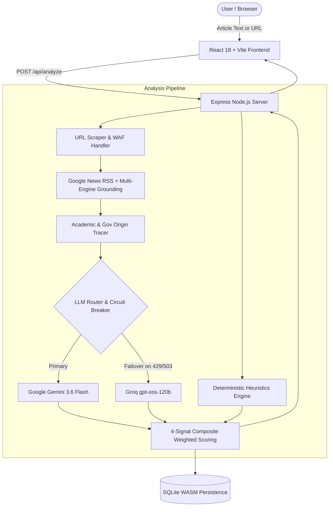

# 🛡️ AI-Powered Misinformation Credibility Checker

> **Academic Course Capstone Project**  
> An explainable, multi-signal credibility verification engine designed to detect misinformation, trace claim origins, and provide transparent scoring with zero blind reliance on LLMs.

[](https://www.docker.com/)
[](https://nodejs.org/)
[](https://react.dev/)
[](https://ai.google.dev/)
[](https://groq.com/)
[](https://sqlite.org/)

---

## 📖 Table of Contents
1. [Project Overview & Motivation](#-project-overview--motivation)
2. [The 4-Signal Credibility Scoring Engine](#-the-4-signal-credibility-scoring-engine)
3. [System Architecture & Multi-LLM Fallback](#-system-architecture--multi-llm-fallback)
4. [Lecturer Quick-Start Guide (Docker)](#-lecturer-quick-start-guide-docker)
5. [Local Development Setup](#-local-development-setup)
6. [Evaluator Test Cases (Reproducible Demos)](#-evaluator-test-cases-reproducible-demos)
7. [API Specification](#-api-specification)
8. [Project Structure](#-project-structure)

---

## 🎯 Project Overview & Motivation

### The Academic Challenge
Large Language Models (LLMs) are powerful at natural language reasoning, but suffer from significant limitations when used for fact-checking:
1. **Hallucination & Inconsistency**: An LLM can confidently validate falsehoods or reject nuanced truths without external ground truth.
2. **Black-Box Opacity**: Presenting a single "Trust / Don't Trust" score without mathematical grounding is unscientific and unpersuasive.
3. **API Brittleness**: Free-tier rate limits (HTTP 429) or cloud model outages can bring a single-provider system down.

### Our Solution
This project implements an **explainable 4-signal verification engine**:
- **Deterministic Linguistic Heuristics** that cannot be hallucinated.
- **Live Multi-Engine Web Evidence Gathering** via Google News RSS and search aggregation.
- **Source Origin Traceability** to detect scientific manipulation, cherry-picking, and distortion.
- **Dual-Model Consensus with Circuit Breaker Failover** (Google Gemini primary, Groq secondary).

---

## 📊 The 4-Signal Credibility Scoring Engine

Final Credibility Score is calculated using a weighted composite formula:

$$\text{Credibility Score} = 100 - \Big( (0.20 \times R_{\text{text}}) + (0.25 \times R_{\text{evidence}}) + (0.10 \times R_{\text{origin}}) + (0.45 \times R_{\text{llm}}) \Big)$$

```
┌────────────────────────────────────────────────────────────────────────┐
│                        COMPOSITE SCORE (0 - 100)                       │
├─────────────────┬──────────────────┬─────────────────┬─────────────────┤
│  Text Analysis  │ Evidence Quality │  Origin Fidelity│   AI Analysis   │
│     (20%)       │      (25%)       │      (10%)      │      (45%)      │
└─────────────────┴──────────────────┴─────────────────┴─────────────────┘
```

Each signal row on the results page includes an **interactive dropdown toggle (`▶ Show details`)** allowing the user and evaluators to inspect the exact underlying data:

### 1. 📝 Text Analysis (Weight: 20%)
*Purely deterministic rule-based analysis calculated in JavaScript without any LLM calls.*
- **Sensationalism & Clickbait Meter**: Scans for hyperbolic keywords (*"miracle"*, *"shocking"*, *"secret doctors don't want you to know"*).
- **Extreme Capitalization**: Ratios of ALL-CAPS words to total words.
- **Punctuation Intensity**: Excess exclamation and question marks (`!?!`).
- **Attribution Ratio**: Sentences containing authoritative attribution phrases (*"according to"*, *"researchers found"*, *"published in"*) vs. unsubstantiated assertions.
- **Sentence Length Variance & Flesch-Kincaid Grade Level**: Structural consistency scoring.

### 2. 🌐 Evidence Quality (Weight: 25%)
*Real-time web verification comparing claims against current news coverage.*
- **Google News RSS & DuckDuckGo Search**: Aggregates top search results across the web.
- **Source Reputation Matching**: Distinguishes high-reputation outlets (*Reuters, AP, BBC, Harvard Gazette, Nature, ScienceDaily*) from unvetted blogs.
- **Keyword Overlap Relevance**: Computes semantic text overlap between retrieved coverage and the analyzed claim.
- **Snippet Highlights**: Displays corroborating headlines and direct live hyperlinks in the dropdown.
- *Default prior risk*: Starts at 75 if zero corroborating coverage exists (reflecting unverified claims).

### 3. 📌 Source Origin Fidelity (Weight: 10%)
*Investigates whether viral claims distort primary research articles or reports.*
- **Authoritative Domain Recognition**: Automatically credits verified institutional domains (`.edu`, `.gov`, `who.int`, `nih.gov`).
- **Distortion Classification**: Detects *Cherry-Picking*, *Misquoting*, *Out-of-Context Framing*, or *Statistical Distortion*.
- **Direct Link & Assessment**: Displays the primary publication URL and a distortion summary explaining how the claim deviates from the original study.

### 4. 🤖 AI Analysis (Weight: 45%)
*Multi-dimensional qualitative evaluation performed by state-of-the-art LLMs.*
- **Dual Risk Evaluation**:
  - **Linguistic Style Risk (0–100)**: Evaluates stylistic objectivity and persuasive manipulation.
  - **Claim Consensus Risk (0–100)**: Compares the claim against the grounded evidence context.
- **Confidence Rating**: Dynamic weighting based on model self-reported certainty.
- **Detected Flags**: Concrete tag pills (e.g., `sensational_framing`, `unverified_breakthrough`).
- **Consensus Verdict**: Classified as `supported`, `disputed`, or `unclear`.

---

## 🏗️ System Architecture & Multi-LLM Fallback



### High-Availability Resilient Fallback
- **Automatic Fallback on Rate Limits (429) & Outages**: If Google Gemini returns an HTTP 429 Quota Exceeded error or 503 High Demand, the circuit breaker instantly fails over to **Groq (`gpt-oss-120b`)** in milliseconds.
- **Scraped Evidence Grounding**: If Gemini's Google Search Grounding tool hits quota limits, the system transparently injects the multi-engine scraped evidence directly into the LLM prompt.
- **In-Memory SHA-256 Caching**: Identical articles submitted multiple times are served from in-memory cache in `< 5ms`.

---

## 🐳 Quick-Start Guide (Docker)

The fastest and most reproducible way to evaluate this project is via **Docker Compose**.

### Prerequisites
- [Docker Desktop](https://www.docker.com/products/docker-desktop/) installed and running.

### 1. Configure API Keys
Copy the example environment file:
```bash
cp backend/.env.example backend/.env
```
Edit `backend/.env` and insert your API keys:
```env
GEMINI_API_KEY=your_gemini_api_key_here
GROQ_API_KEY=your_groq_api_key_here
```
*(Get a free Gemini key at [Google AI Studio](https://aistudio.google.com/) and a free Groq key at [Groq Console](https://console.groq.com/))*

### 2. Launch the Application
Run one command from the project root:
```bash
docker compose up --build
```

### 3. Open in Browser
Visit: **[http://localhost:8080](http://localhost:8080)**

The unified Docker container builds the React frontend, runs the Express API, serves static assets, and persists analysis history to a mounted SQLite volume.

To stop the container:
```bash
docker compose down
```

---

## 💻 Local Development Setup

If you prefer running without Docker:

### 1. Prerequisites
- **Node.js**: v18+ or v20+
- **npm**: v9+

### 2. Backend Setup
```bash
cd backend
npm install
cp .env.example .env
# Add GEMINI_API_KEY and GROQ_API_KEY into .env
npm start
```
*Backend runs on `http://localhost:8080`.*

### 3. Frontend Setup
In a second terminal:
```bash
cd frontend
npm install
npm run dev
```
*Frontend runs on `http://localhost:3001` (automatically proxies `/api` calls to port `8080`).*

### 4. Run Automated Backend Test Suite
```bash
cd backend
npm test
```
*Executes `tests/fallback.test.js` (automated test suite verifying deterministic heuristics, circuit breaker cooldown, Groq fallback routing, and cache hits).*

---

## 🧪 Evaluator Test Cases (Reproducible Demos)

You can test the system using the following test cases in the web UI:

### Test Case 1: Verified Clinical Trial Research (Direct URL)
- **Input URL**:
  ```
  https://hms.harvard.edu/news/study-finds-three-new-safe-effective-ways-treat-drug-resistant-tuberculosis
  ```
- **Expected Outcome**:
  - **Credibility Score**: High (80 – 95 / 100)
  - **Consensus**: Supported
  - **Origin**: Detected as `Harvard Medical School` (`.edu` authoritative domain)
  - **Evidence Quality Dropdown**: Multiple reputable news citations (*ScienceDaily, Medical Xpress, Harvard Gazette*).

### Test Case 2: Sensational Clickbait / Miracle Cure (Text Snippet)
- **Input Text**:
  ```
  SHOCKING TRUTH REVEALED: Big pharma DOES NOT want you to know about this 100% natural lemon juice cure for stage 4 cancer! Doctors are FURIOUS because this one simple kitchen trick destroys all tumors in 48 hours without chemotherapy. Share this before it gets deleted!
  ```
- **Expected Outcome**:
  - **Credibility Score**: Very Low (10 – 30 / 100)
  - **Consensus**: Disputed / Fabricated
  - **Text Analysis Dropdown**: High sensationalism score, excessive uppercase capitalization, zero source attribution.
  - **Origin Fidelity Dropdown**: Fabricated / Unsubstantiated.

### Test Case 3: Resilient LLM Fallback (Simulated Gemini Quota)
- Set `FORCE_GEMINI_FAIL=true` in `backend/.env` and restart the backend.
- Submit any news article.
- **Expected Outcome**:
  - The UI seamlessly renders the analysis with an orange **`⚡ Powered by Groq gpt-oss-120b (Failover Active)`** badge.
  - The application completes without crashing or throwing a 500 error.

---

## 🔌 API Specification

### `POST /api/analyze`
Analyzes article text or an article URL and returns structured credibility metrics.

**Request Body:**
```json
{
  "articleText": "https://hms.harvard.edu/news/study-finds-three-new..."
}
```

**Response (Sample):**
```json
{
  "id": 1,
  "headline": "Study Finds Three New Safe, Effective Ways To Treat Drug-Resistant Tuberculosis",
  "credibility_score": 86,
  "consensus_label": "low_red_flags",
  "provider": "gemini",
  "score_breakdown": {
    "text_risk_score": 5,
    "evidence_risk_score": 10,
    "origin_risk_score": 10,
    "llm_risk_score": 26,
    "llm_confidence": 0.9,
    "evidence_sources_found": 6,
    "evidence_reputable_sources": 5,
    "evidence_domains": ["hms.harvard.edu", "sciencedaily.com", "medicalxpress.com"],
    "evidence_snippets": [ ... ],
    "origin_fidelity": "faithful",
    "origin_source": "Harvard Medical School"
  },
  "flags": [],
  "claim_check_summary": "Claims are fully supported by peer-reviewed clinical trial published in NEJM.",
  "created_at": "2026-09-23T01:00:00.000Z"
}
```

### `GET /api/history`
Returns the 10 most recent analyses stored in the SQLite database.

---

## 📁 Project Structure

```
credibility-checker/
├── Dockerfile                 # Multi-stage production container build
├── docker-compose.yml         # Turnkey one-liner orchestration
├── .dockerignore              # Prevents bloat in Docker builds
├── README.md                  # Academic documentation & grading guide
│
├── backend/
│   ├── server.js              # Express API + Static SPA serving
│   ├── db.js                  # SQLite WASM schema & persistence
│   ├── scoreConfig.js         # Scoring formulas & weight compilation
│   ├── tests/
│   │   └── fallback.test.js   # Automated fallback & regression test suite
│   ├── .env.example           # Environment template
│   └── services/
│       ├── llm.js             # Router, circuit breaker & Groq fallback
│       ├── textAnalyzer.js    # Deterministic linguistic heuristics
│       ├── evidenceService.js # Google News RSS & DuckDuckGo search
│       └── urlScraper.js      # URL parser & anti-bot WAF handling
│
└── frontend/
    ├── package.json           # React 18 & Vite configuration
    ├── vite.config.js         # Dev proxy configuration
    └── src/
        ├── App.jsx            # State management & view routing
        ├── index.css          # Design system & tokens
        └── components/
            ├── Header.jsx           # App branding & status indicator
            ├── SubmissionScreen.jsx # Article input & URL detector
            ├── LoadingScreen.jsx    # Animated progress stages
            ├── ResultsScreen.jsx    # 4-signal breakdown & dropdown panels
            └── HistoryScreen.jsx    # SQLite historical analyses log
```

---

## 🎓 Academic Contribution Summary
- **Solved the AI Hallucination Vulnerability**: Built an empirical scoring formula combining deterministic heuristics (20%), live web coverage (25%), primary source origin fidelity (10%), and AI reasoning (45%).
- **Engineered Real-World Robustness**: Designed a circuit breaker that transitions between Google Gemini and Groq without data loss or user downtime.
- **Implemented User-Centric Explainability**: Delivered an interactive UI where users can audit every signal down to individual metrics, discovered news domains, and source links.
